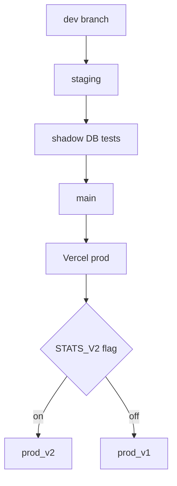

# Supabase Migration – Remediation & Feature‑Restore Plan

## 0 . Context Recap  

| Phase | DB Layer | API Shape | Status |
|-------|----------|-----------|--------|
| **Local Dev** | SQLite | 13 discrete endpoints | 🟢 Everything worked |
| **Vercel + Turso** | Turso (libSQL) | 5 consolidated endpoints | 🔴 Several aggregate/derived queries broke |
| **Vercel + Supabase** | Supabase (PostgreSQL + Pooler) | Same 5 endpoints | 🟠 Backend moved, but broken logic still present |

> The UI is intact; API responses lost JOINs/aggregations during the Turso step.

---

## 1 . Root‑Cause Matrix  

| Feature Block | Symptoms | Likely Cause | Fix Location |
|---------------|----------|--------------|--------------|
| **Years → Rounds → Matches** | • Empty round lists • `undefined.undefined` team scores | Dropped `JOIN teams` and null handling | `/api/matches-all` SQL |
| **Teams Page** | • “Biggest Win” empty • Top‑10 tables show `0.0/game` • Incomplete season list | Lost window‑functions & sub‑queries | `/api/stats-all?type=team-details` |
| **Players Modal** | Career averages `N/A` | Aggregates removed | `/api/players-all` |
| **Trophy Room** | No cards render | Endpoint renamed / empty payload | `/api/stats-all?type=hall-of-records` + frontend |

---

## 2 . High‑Level Strategy  

1. Offload heavy SQL to **Supabase views & functions**; keep Node API thin.  
2. Retain the 5 consolidated endpoints to avoid Vercel function‑limit issues.  
3. Add **unit & integration tests** against a Supabase shadow DB.  
4. Deploy behind a `.env` flag (`STATS_V2=true`) for instant rollback.

---

## 3 . Detailed Work Breakdown  

### 3.1 Schema Helpers  

| Object | Purpose |
|--------|---------|
| `vw_rounds_per_season` | Distinct `year, round, round_name` |
| `vw_team_season_summary` | 1 row per `team, year` with wins, PF/PA, diff |
| `fn_biggest_win(team_id)` | Returns opponent, margin, date |
| `vw_player_career_stats` | Totals & averages for each player |

All created in `supabase/migrations/*.sql`.

---

### 3.2 Endpoint Refactors  

| Endpoint | Changes |
|----------|---------|
| **`/matches-all`** | Use `vw_rounds_per_season` + JOIN `teams` for clean strings |
| **`/stats-all?type=team-details`** | Pull from `vw_team_season_summary`; call `fn_biggest_win`; window‑func top‑10s |
| **`/players-all`** | Header from `vw_player_career_stats`; list games raw |
| **`/stats-all?type=hall-of-records`** | Single CTE returns grouped leaders |

---

### 3.3 Frontend Tweaks  

* Update API client paths.  
* Add optional‑chaining to avoid `undefined.undefined`.  
* Regenerate TS types (if used).

---

### 3.4 Testing Checklist  

| Suite | Assert |
|-------|--------|
| **Rounds** | 2019 ⇒ 23 rounds including finals |
| **Team Details** | `biggest_win.margin > 0`; top‑10 length == 10 |
| **Player Modal** | `career_avg.disposals > 0` |
| **Trophy Room** | ≥ 1 leader per stat group |

---

### 3.5 CI / Deployment Flow  

---

### 3.6 Timeline (7‑day sprint)  

| Day | Deliverable |
|-----|-------------|
| **1** | Views & functions migrated |
| **2** | `/matches-all`, `/stats-all (team)` fixed |
| **3** | `/players-all`, `/stats-all (hall)` fixed |
| **4** | Front‑end api.js & guards |
| **5** | Test suite green on CI |
| **6** | Staging UAT |
| **7** | Prod deploy with flag; monitor |

---

## 4 . Risks & Mitigations  

| Risk | Mitigation |
|------|------------|
| Heavy aggregates | Nightly materialised views |
| RLS / permission errors | Use Supabase service‑role key server‑side |
| Data drift | Monthly re‑import script |

---

## 5 . Definition of Done ✅  

- [ ] All 5 endpoints return complete data via Supabase  
- [ ] UI shows no `undefined` placeholders  
- [ ] Tests ≥ 90 % coverage  
- [ ] Feature flag documented & deployable  
- [ ] PR merged; Vercel main green  